<div align="center">
  <h1>Ingeniería de datos con Python</h1>
</div>

<div align="center"> 
  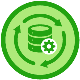
</div>

# Introducción al documento

El contenido de este documento son **apuntes teoricos** y un proyecto **Web Scrapper** del [Curso de Ingeniería de datos con Python](https://platzi.com/clases/ingenieria-datos/) y busca ser una guía para futuros trabajos personales. El mismo está dictado por [David Aroesti](https://github.com/jdaroesti) del team [Platzi](https://platzi.com).

# Objetivos del documento

- **Teoria.** Plasmar los fundamentos de la ingenieria de datos.
- **Práctica.** Crea un Web Scrapper profesional siguiendo el flujo de trabajo de un Ingeniero de Datos.


# Tabla de contenido

- [Introducción](#Introducción)
    - [Introducción al curso](#Introducción-al-curso)
    - [¿Qué es la Ciencia e Ingeniería de Datos?](#¿Qué-es-la-Ciencia-e-Ingeniería-de-Datos?)
    - [Roles](#Roles)
    - [Configuración del ambiente](#Configuración-del-ambiente)
    - [Jupyter Notebooks](#Jupyter-Notebooks)
    - [Profundizando en tipos de datos](#Profundizando-en-tipos-de-datos)
    - [Fuentes de datos](#Fuentes-de-datos)
    - [ETL](#ETL)
- [Web scraping](#Web-scraping)
  - [Introducción a las tecnologías web](#Introducción-a-las-tecnologías-web)
  - [Realizar solicitudes HTTP con Python](#Realizar-solicitudes-HTTP-con-Python)
  - [¿Cómo trabajar con un documento HTML?](#¿Cómo-trabajar-con-un-documento-HTML?)
  - [Analizando un sitio web para encontrar las directivas a utilizar al hacer un web scrapping](#Analizando-un-sitio-web-para-encontrar-las-directivas-a-utilizar-al-hacer-un-web-scrapping)
  - [Solicitudes a la web - Requests](#Solicitudes-a-la-web---Requests)
  - [Implementando nuestro web scrapper - Configuración](#Implementando-nuestro-web-scrapper---Configuración)
  - [Implementando nuestro web scrapper - Obteniendo enlaces del front page](#Implementando-nuestro-web-scrapper---Obteniendo-enlaces-del-front-page)
  - [Implementando nuestro web scrapper - Obteniendo artículos](#Implementando-nuestro-web-scrapper---Obteniendo-artículos)
  - [Obtención de datos del Artículo](#Obtención-de-datos-del-Artículo)
  - [Persistiendo la información \"scrapeada\"](#Persistiendo-la-información-\"scrapeada\")
- [Pandas](#Pandas)
  - [Introducción a Pandas](#Introducción-a-Pandas)
  - [Estructura de datos - Series](#Estructura-de-datos---Series)
  - [Estructura de datos - DataFrames](#Estructura-de-datos---DataFrames)
  - [Índices y selección](#Índices-y-selección)
  - [Data wrangling con Pandas](#Data-wrangling-con-Pandas)
  - [Creación de la receta](#Creación-de-la-receta)
    - [Preparando la automatización](#Preparando-la-automatización)
  - [¿Cómo trabajar con datos faltantes?](#¿Cómo-trabajar-con-datos-faltantes?)
  - [Operaciones con Series y DataFrames](#Operaciones-con-Series-y-DataFrames)
  - [Limpiando detalles adicionales](#Limpiando-detalles-adicionales)
  - [Limpiando detalles en nuestro proyecto](#Limpiando-detalles-en-nuestro-proyecto)
  - [Enriquecimiento de los datos](#Enriquecimiento-de-los-datos)
  - [Valores duplicados](#Valores-duplicados)
    - [En Jupyter](#En-Jupyter)
    - [En Python](#En-Python)
  - [Guardando dataset](#Guardando-dataset)
  - [Visualización de datos](#Visualización-de-datos)
- [Intro a Sistemas de Datos](#Intro-a-Sistemas-de-Datos)
  - [Introducción a los sistemas de datos](#Introducción-a-los-sistemas-de-datos)
    - [SQL vs NoSQL](#SQL-vs-NoSQL)
  - [Cargando datos a SQLite](#Cargando-datos-a-SQLite)
- [ETL Pipeline - Automatización](#ETL-Pipeline---Automatización)
- [Contenido Bonus](#Contenido-Bonus)
  - [Porque usar la nube](#Porque-usar-la-nube)


## Introducción
### Introducción al curso

En este curso vamos a explorar cuál es el proceso que se sigue en la **ingeniería de datos**. Obtener obtener datos y datasets del mundo real de diferentes fuentes y lugares. Casi siempre estos datos vienen en un formato o estructura que no esta lista para el **análisis** adecuado.

La ingeniería de datos se preocupan principalmente por implementar los **pipelines** que permiten automatizar la obtención de datos y su posterior limpieza para que otros profesionales de los datos(científicos de datos o expertos en machine learning) puedan realizar su labor. **Son la primera parte de la cadena**.

Podrás entender el día a día de un ingeniero de datos y cómo colabora con el resto del equipo.

### ¿Qué es la Ciencia e Ingeniería de Datos?

La Ciencia de Datos es la disciplina que se encarga de extraer conocimiento de los datos disponible. Casi siempre cuando te realizas una pregunta sobre datos estas fuentes se encuentran escondidas, ocultas o de difícil acceso. A nuestro alrededor hay datos en tu computadora, mesa, reloj, etc.

Los datos están por todas partes.

La Ciencia de datos es multidisciplinaria. A diferencia de muchos otros ámbitos profesionales dentro del mundo de la tecnología cuando hablamos de un científico de datos es una persona que sabe de matemáticas, ingeniería de software y sabe de negocios.

Se apoya en: 
- **Computer science**. Las computadoras son la mejor herramienta para procesar datos. Se apoya de: 
    - Algoritmos
    - Estructura de datos
    - Visualizaciones que nos puede dar la computadora.
    - Conectar varias computadoras en paralelo en la nube, 
    - Programación.
- **Matemática estadística**
    - Regresiones
    - Inferencias
    - Identificación de variables y relación de variables.
- Tener **conocimiento del dominio**
    - Preguntar los correcto
    - Interpretar datos correctamente en función a las preguntas que hagamos.

<div align="center"> 
  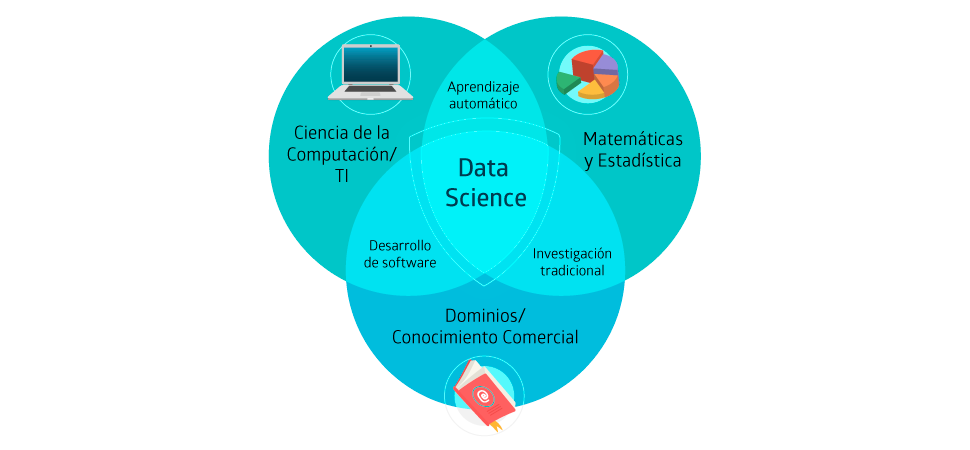
</div>

Herramientas donde se auxilia:

- Bases de Datos
    - SQL (MySQL, Postgres, etc.)
    - NoSQL (Cassandra, Spark, etc.)
- Análisis de texto y procesamiento de lenguaje natural (NLP)
- Análisis de redes
- Análisis numérico de datos y minado de datos
- Visualización de datos
    - No permite contar historias
    - Analizar rapidamente
    - Los humanos somos mas eficientes analizando datos gráficos.
- Machine learning e Inteligencia Artificial
- Análisis de señales digitales. 
    - Análisis de datos en tiempo real. 
- Análisis de datos en la nube (Big Data). Data center que podemos utilizar eficientemente para procesar grandes cantidades de datos

### Roles

Existen por lo menos tres diferentes roles para tener un pipeline completo de ciencia de datos. Este curso trata sobre el primer rol:

- **Data engineer**: Se encarga de obtener los datos, Limpiarlos y estructurarlos para posterior análisis, crear pipelines de análisis automatizado, utilización de herramientas en la nube, análisis descriptivo de los datos.

- **Data scientist**: Una vez tiene los datos se encarga de generar el análisis matemático de ellos, encontrar las relaciones entre las variables, las correlaciones, las causas y por último genera los modelos predictivos y prescriptivos.

- **Machine Learning engineer**: Se encarga de llevar las predicciones a escala, de subirlos a la nube y allí generar muchas predicciones. Se encarga de mantener la calidad del modelo.

<div align="center"> 
  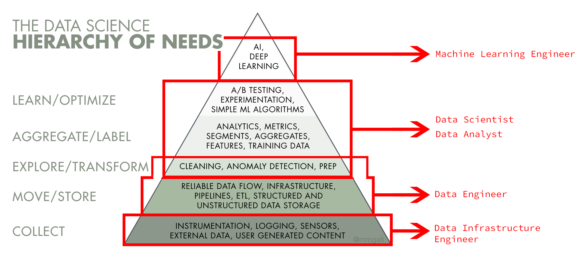
</div>

### Configuración del ambiente

[**Anaconda**](https://www.anaconda.com/) es una instalación de Python que ya trae preinstalado todos los paquetes necesarios para tu labor en la Ciencia de Datos, tiene más de **1400 paquetes**. Nos permite configurar ambientes virtuales para poder utilizar diferentes versiones de nuestros paquetes.

- Para conocer la versión y saber que lo tenemos instalado: 

`conda --version`

- Para ver todos los comandos que podemos usar usamos:

`conda --help` 

- Para ver una lista de todos los paquetes que Anaconda instaló.

`conda list` 


Una buena práctica es generar un **ambiente virtual** por cada proyecto, los ambientes virtuales nos permiten generar varios proyectos con diferentes versiones de la librería sin generarnos errores de compatibilidad. Tradicionalmente en Python se utiliza virtualenv

`conda create --name nombre_entorno`

- Instalar librerias:

`$ conda install nombre_libreria`

- En este caso usaremos las siguientes librerias:
  - **beautifulsoup4** = parsear y manipular HTML
  - **requests** = generar solicitudes a la web
  - **numpy** = análisis numéricos de nuestros datos
  - **pandas** = analizar, modificar, transformar datos y generar análisis descriptivos sobre los mismos
  - **matplotlib** = generar visualizaciones de nuestros datos
  - **yaml** =archivo similar a Json, permite generar algunas configuraciones

Al instalar las librerias se instalan dependendias para que estas funcionen.

- Para activar el ambiente que acabamos de crear: 

`conda activate nombre_entorno`

- Para salir 

`conda deactivate`

- Para ver una lista de los ambientes virtuales que tenemos:

`$ conda info --envs` o tambien `$ conda env list`

- Para ver todos paquetes de nuestro entorno virtual:

`$ conda list -n nombre_entorno`

- Para eliminar nuestro entorno virtual con todos nuestros paquetes

`$ conda remove --name nombre_entorno --all`

### Jupyter Notebooks

Algo interesante que tenemos con Anaconda es que nos trae [Jupyter Notebooks](https://jupyter.org/).

Jupyter Notebooks es un entorno de programación en el cual podemos mezclar ejecución de código en vivo, visualizaciones y añadir markdown.

- Para inicializar nuestro servidor de jupyter:

`$ jupyter notebook`

Jupyter Notebook tiene diferentes tipos de celdas en las cuales podemos escribir código o markdown. Si queremos ejecutar nuestro código hacemos `ctrl + enter` y si queremos ejecutar y añadir una nueva celda `shift + enter`.

- `ESC`: dentro de una celda entrar al modo de navegación. (el borde izquierdo de la celda se resalta en azul)
- `K`: mover hacia arriba
- `J`: mover hacia abajo
- `B`: Agregar nueva celda
- `M`: Convertir en MarkDown
- `P`: Acceder a la línea de comando
- `DD`: Eliminar Celda

Jupyter Notebook tiene dos modalidades, la modalidad de edición y navegación.

### Profundizando en tipos de datos

Los datos vienen en muchas formas y estas formas las podemos clasificar de diferentes maneras, permitiéndonos poder aplicar técnicas distintas a cada uno de los tipos de datos.

- Los primeros datos son los primitivos.
`int, str, bool, float, hex, oct, datetime, objetos especiales`

Tenemos otras clasificaciones como los datos estructurados, semi estructurados y no estructurados.

- Los **estructurados** son los más fáciles de acceder a su información.
  - Bases de datos
  - Data warehouse
- Los **semis estructurados** donde podemos usar las APIs
  - json API's
  - Datos tabulares (csv, excel)
- Los **No estructurados** son la mayoría de los datos que te vas a encontrar en tu desarrollo profesional.
  - HTML
  - Texto libre
  - Imagenes, audios, videos
  - Datos científicos

<div align="center"> 
  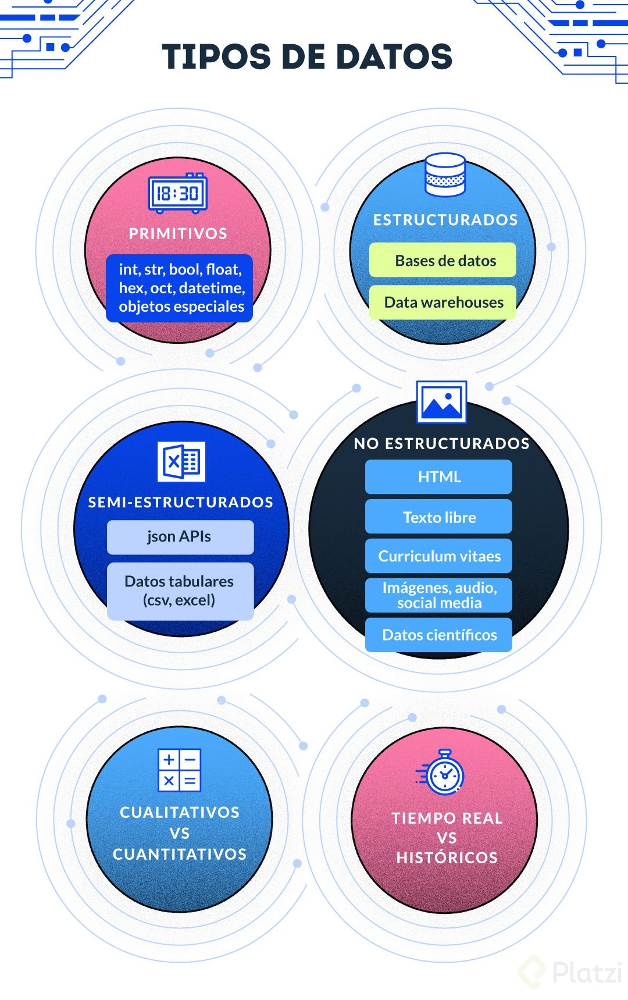
</div>

### Fuentes de datos

- **Web**

Es una mina enorme con datos financieros, de startups, del clima, precipitación fluvial, astronómicos, de negocios, etc.


- **APIs**

Endpoints que viven en la web y nos devuelven JSON. Por ejemplo, la API de twitter, google, facebook.

Todas las [API's de google](https://console.cloud.google.com/apis/library) que este nos ofrece.

- **User Analytics**

Son el comportamiento del usuario dentro de nuestra aplicaciones, algo similar a los que nos ofrece Google Analytics.

- **IoT**

El [IoT o Internet of Things](https://es.wikipedia.org/wiki/Internet_de_las_cosas) Se ha vuelto una mina espectacular en los últimos años. Como automóviles, sensores en edificios y todo aquello que se pueda conectar a internet. 

En los siguientes enlaces podemos encontrar gran cantidad de datset asi como tambien un buscado de estos desarrollado por google.

- [Dataset Search de Google](https://datasetsearch.research.google.com/)
- [Data Word](https://data.world/)
- [Kaggle](https://www.kaggle.com/)

### ETL

**ETL = Extract Transform Load**

Los procesos ETL son un término estándar que se utiliza para referirse al movimiento y transformación de datos. Se trata del proceso que permite a las organizaciones mover datos desde múltiples fuentes, reformatearlos y cargarlos en otra base de datos (denominada data mart o data warehouse) con el objeto de analizarlos. También pueden ser enviados a otro sistema operacional para apoyar un proceso de negocio.

Si separamos por puntos cada uno haría lo siguiente:
- **Extract**: Es el proceso de lectura de datos de diversas fuentes

  - Base de datos
  - CRM
  - Archivos CSV
  - Datasets públicos

- **Transform**: En este momento cuando nosotros tenemos que transformar los datos, tenemos que identificar datos faltantes o datos erróneos o una edad negativa. En esta etapa donde tenemos que identificar todos los problemas y solucionarlos.

  - Limpieza
  - Estructurado
  - Enriquecimiento.

- **Load**: Una vez transformados debemos insertarlos en el data warehouse

  - Depende del tipo de solución que se haya escogido

<div align="center"> 
  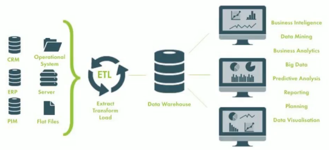
</div>


## Web scraping

### Introducción a las tecnologías web

Las tecnologías web en principio podemos pensarlas como el internet, pero el internet es mucho más grande, es la red de redes, la forma en la que millones de computadores se conectan entre ellas para transferirse información.

El internet también se compone de otros pedazos (entre parentesis sus protocolos) como telefonía(voip), mail(pop3, imap), compartir archivos(ftp). El internet es una red que une varias redes públicas, privadas, académicas, de negocios, de gobiernos, etc.

La web específicamente es un espacio de información en el cual varios documentos(y otros recursos web) se pueden acceder a través de URLs y vínculos(links). La comunicación se da a través del protocolo **HTTP**.

Elementos básicos de la web:

- **HTML**: nos da la estructura de la información. Es un lenguaje para anotar pedazos de información para que el navegador o otros tipos de programa puedan interpretar que tipo de información se encuentra ahí.
- **CSS**: nos permite darle colores, arreglar el texto y añadir diferentes elementos de presentación.
- **Javascript**: nos permite añadir interactividad y cómputo a nuestra web.
- **JSON**: Simplemente es una forma de transmitir datos entre servidores y clientes. Es la forma estándar en las que en la web y las aplicaciones se comunican con los servidores backend.

### Realizar solicitudes HTTP con Python

Para poder experimentar con la web necesitamos un método programático para solicitar URLs y obtener HTML

**Requests**: Nos permite generar solicitudes a la web dentro de Python y utilizar los diferentes verbos HTTP, normalmente utilizaremos el método **GET** porque vamos a traer datos.

`requests.get('url')` para hacer una solicitud a la web y nos devolverá un objeto `response`

Al hacer una solicitud HTTP necesitamos saber en que estado será la misma con `responde.status_code`. Las posibles respuestas son:

- 200 : OK - Petición correcta.
- 400 : Bad request - Petición incorrecta.
- 404 : Not found - Recurso no encontrado.

Estos códigos estan categorizados en los siguientes grupos:

- 1xx : Respuestas informativas (Ej: 100, 101, 102, etc.)
- 2xx : Peticiones correctas (Ej: 200, 201, 202, etc.)
- 3xx : Redirecciones (Ej: 300, 301, 302, etc.)
- 4xx : Errores en el lado del cliente (Ej: 400, 401, 402, etc.)
- 5xx : Errores en el lado del servidor (Ej: 500, 501, 502, etc.)

Todas las solicitudes HTTP tienen metadatos para que los diferentes sistemas y computadoras puedan entender de qué va la solicitud.

[Script de solicitudes a la web](https://github.com/francomanca93/ingenieria-de-datos/blob/master/practicas/solicitud-extraccion-info-html.ipynb)

### ¿Cómo trabajar con un documento HTML?

En el caso de Python la librería estándar para manipular los documentos HTML se llama **BeautifulSoup**.

**BeautifulSoup** nos ayuda a organizar gramaticalmente(parsear) el documento HTML para que tengamos una estructura con la cual podamos manejar y extraer información. BeautifulSoup convierte el string de HTML en un árbol de nodos para poder manipularlo.

Para manipularlo podemos usar los selectores CSS con `soup.select()`

[Script de extracción de datos en un documento HTML](https://github.com/francomanca93/ingenieria-de-datos/blob/master/practicas/solicitud-extraccion-info-html.ipynb)

### Analizando un sitio web para encontrar las directivas a utilizar al hacer un web scrapping

Para poder desarrollar scrapers debemos entender los datos semi estructurados dados por el HTML para determinar qué tipo de selectores CSS necesitamos para sacar información.

### Solicitudes a la web - Requests

Un buen **Data engineer** utiliza los conceptos de la ingeniería de software para poder desarrollar sus programa. En nuestro caso para poder desarrollar nos apoyaremos de un patrón.

**Page Object Patter**: Es un patrón que consiste en esconder los _queries_ especificos que se utilizan para manipular un documento HTML detrás de un objeto que representa la página web.

Si estos _queries_ se añaden directamente al código principal, el código se vuelve frágil y va a depender mucho de la modificación que hagan a la web otras personas y arreglarlo se vuelve muy complicado.

### Implementando nuestro web scrapper - Configuración

Se crearán tres archivos para configurar el esqueleto del proyecto web scraper

- [config.yaml](https://github.com/francomanca93/ingenieria-de-datos/commits/master/web-scrapper/config.yaml): El siguiente archivo contendra la configuración y datos necesarios para screapear web sitios web que coloquemos en este.

  Los YAML es un formato para guardar objetos de datos con estructura de árbol. Sirven como archivos para configuración similares a json. La librería que usaremos para trabajar con estos es [pyyaml](https://pyyaml.org/wiki/PyYAMLDocumentation)

  [Un poco mas sobre YAML](https://fercontreras.com/conoce-que-es-un-yaml-e18e9d21ade4)

- [common.py](https://github.com/francomanca93/ingenieria-de-datos/commits/master/web-scrapper/common.py): Archivo .py para guardar funciones comunes que se utilizarán
- [main.py](https://github.com/francomanca93/ingenieria-de-datos/commits/master/web-scrapper/main.py): Archivo principal con el cual se hará interacción con la linea de comando. En el se llamará a otras clases, metodos y/o archivos. Se agregarán algunas librerias/módulos para poder:
  - Trabajar con la linea de comando. El módulo [argparse](https://rico-schmidt.name/pymotw-3/logging/index.html) sirve para análisis de opciones y argumentos de línea de comando.
  - Ver de una forma más amigable mensajes en la linea de comando. El módulo [logging](https://rico-schmidt.name/pymotw-3/logging/index.html) sirve para hacer informes de estados, error y mensajes informativos. 

### Implementando nuestro web scrapper - Obteniendo enlaces del front page

En esta sección lo que se hará es ir a la pagina principal a través de BeautifulSoup y luego identificar todos los vinculos que nos llevaran a los articulos de noticia principales.

- Se agrega el archivo [news_page_objects.py](https://github.com/francomanca93/ingenieria-de-datos/commit/30d5fb0df0606e11b43a6bad32c25518403c9a2e#diff-17475357362c0f9e134381cd0e104388): Este tiene una clase HomePage que va a representar la página principal de nuestra web. Tiene métodos para:
  - Obtener los links principales de la web a consultar.
  - Obtener informacion de config.yaml.
  - Parsear el html de la url que pasemos.

Para realizar una **request/response (solicitd/respuesta) http** se utilizará el módulo [requests](https://requests.readthedocs.io/es/latest/).

Para realizar perseado de una página web se utiliza BeautifulSoup. Mas información sobre la librería en el siguiente [link](https://code.tutsplus.com/es/tutorials/scraping-webpages-in-python-with-beautiful-soup-the-basics--cms-28211)

- Se instancio de la clase HomePage el objeto homepage para luego imprimir links principales.
- Se agregarón nuevas paginas para parsear y queries a selectores html. 

### Implementando nuestro web scrapper - Obteniendo artículos

Lo que se hará en esta sección es crear clases que representen a una página genérica y luego de esta heredarán nuestra Pagina principal y la página del artículo. 

Se agregarán nuevas clases en el archivo [news_page_objects.py](https://github.com/francomanca93/ingenieria-de-datos/commit/c4840816707527a56302b64da9bb5e0c2a18bd83#diff-17475357362c0f9e134381cd0e104388)
- `NewsPage()`: Clase que va a representar a nuestra web. Esta tiene los siguientes métodos
    - `_select`: Funcion para obtener informacion de config.yaml.
    - `_visit`: Función para parsear el html de la url que pasemos.
- `HomePage(NewsPage)`: Clase que va a representar la página principal de nuestra web. Hereda de NesPage(). Tiene un método principal.
    - `article_links`: Método para obtener los links principales de la web a consultar.
- `ArticlePage(NewsPage)`: Clase que va a representar un artículo de la web. Tiene dos métodos principales:
    - `body`: Método para seleccionar el cuerpo del artículo.
    - `title`: Método para seleccionar el título del artículo.

### Obtención de datos del Artículo
Hecha la abstraccion con las clases correspondientes para poder obtener los datos de un articulo de una pagina, lo que se hará es validar que los vinculos se encuentran en el formato correcto o convertirlo.
Luego se visitará cada pagina y se consultará el título y el cuerpo para ir armando el datasets.

Se recorrerá cada una de las url del homepage para saber si existe un articulo o no. Los viculos vienen de diversas formas:
- Completos y bien formados.
- Vinculos relativos
- Vinculos relativos a la raiz de la url

Se utilizará la libreria [**re**](https://docs.python.org/3/library/re.html#module-contents). Este nos permite generar expresiones regulares en Python para poder determinar cual de los vinculos es válido o no, y asi poder obtener toda la informacion.

- En main inicializamos a nuestro objeto articlePage
- Crearemos las siguientes funciones en [main.py](https://github.com/francomanca93/ingenieria-de-datos/commit/c1eb14e5ace4710f55bf1502bcfc5773757950d1#diff-c85a2c3c9e83e1b7b251b7905cf347e2)
  - `_fetch_article`: Función para buscar un artículo.
  - `_build_link`: Función que nos permitirá crear un link perfecto al cual podamos acceder. Crear un patron de expresion regulares para poder implementar la funcion
    - Utilizaremos dos objetos con un patron diferentes para detectar enlaces. **^** Indica que empieza la expresión regular
      - is_well_formed_link = re.compile(r'^https?://.+/.+$')  # https://example.com/hello
      - is_root_path = re.compile(r'^/.+$')  # /some-text

### Persistiendo la información \"scrapeada\"

La persistencia de información se trata de guardar en un archivo los datos que estamos minando de la web para luego manipularlos. 

Lo que hacemos en esta sección es agregar la siguiente función en [main.py](https://github.com/francomanca93/ingenieria-de-datos/commit/f760d915473181e0f579a1773f9948d45e34ae50#diff-c85a2c3c9e83e1b7b251b7905cf347e2):
- `_save_article`: Función para guarda en un csv el body de articulos screapeados.


## Pandas

### Introducción a Pandas

[**Pandas**](https://pandas.pydata.org/) nos otorga diversas facilidades para el **Data Wrangler** (““domados de datos””). Nos otorga dos estructuras de datos:

- **Seriesimport**: Es un array unidimensional que representa una columna.
- **DataFrame**: Es un conjunto de series que forman una tabla. Se pueden acceder a través de indices como una etiqueta(label) o pueden ser posicionales es decir 0 o índice 100. También pueden ser **rangos** o slices

Estas estructuras de datos **no son** contenedores de datos. En Pandas las utilizamos para: 
- Transformar y enriquecer nuestros datos.
- Manipular nuestros datos.
- Manejar los datos faltantes.
- Realizar operaciones aritméticas.
- Combinar diferentes dataframes en uno solo para obtener una nueva tabla.
- etc.

[**Pandas Cheat Sheet**](https://s3.amazonaws.com/assets.datacamp.com/blog_assets/PandasPythonForDataScience.pdf)

### Estructura de datos - Series

**Series** es un vector unidimensional, para poder acceder a esta lista podemos usar posiciones o labels, siendo este último el preferido para manipular las series. Una diferencia importante sobre las listas de Python es que los datos son homogéneos, es decir **solo podemos tener un tipo de dato por cada Serie**.

Las Series se pueden crear a partir de cualquier secuencia(listas, tuplas, arrays de numpy y diccionarios).

En Python tenemos la filosofía del Duck Typing, si se ve como un pato y hace cuac, a ese animal le llamamos pato, si una serie se comporta una lista, se accede como una lista en principio deberíamos llamarla lista, pero esto no es así.

Una mejor aproximación para inicializar Series es utilizar diccionarios.

[Documentación oficial Pandas: Series](https://pandas.pydata.org/pandas-docs/stable/reference/series.html)

### Estructura de datos - DataFrames

**DataFrames** son simplemente una tabla donde las filas y las columnas tienen etiquetas, se puede construir de diferentes formas pero siempre debemos considerar que la estructura que necesitamos construir para inicializarla tiene que ser bidimensional. Una matriz y puede ser una lista de listas, lista de tuplas, un diccionario de Python u otro **DataFrame**.

Si solo tenemos una dimensión a eso no le llamamos **DataFrame**, le llamamos Serie. Cuando utilizamos un diccionario las llaves se convierten en las llaves de la columna.

[Documentación oficial Pandas: DataFrame](https://pandas.pydata.org/pandas-docs/stable/reference/frame.html)

### Índices y selección

Existen muchas formas de manipular los DataFrames y de seleccionar los elementos que queremos transformar.

Como diccionarios - Dictionary like:
```py
df['col1'] 
df[['col1', 'col3']]
```
Como Numpy - Numpy like:

iloc = index location
```py
df.iloc[:]
df.iloc[:,:]
```
Basado en etiquetas - Label based:

loc = location
```py
df.loc[:]
df.loc[:,:]
```

Existe una gran diferencia en la forma en la que utilizamos estos slices porque varia de la forma tradicional de Python. loc va a incluir el final del que necesitamos.

### Data wrangling con Pandas

**Data wrangling** es una de las actividades más importantes de todos los profesionales de datos. Simplemente es limpiar, transformar y enriquecer el dataset para objetivos posteriores.

Pandas es una de las herramientas más poderosas para realizar este ““domado”” de datos. Recordemos que Pandas trae muchas de sus abstracciones del lenguaje R, pero nos otorga lo mejor de ambos mundos, por eso es tan popular.

Nos permite:

- generar transformaciones con gran facilidad.
- trabajar rápidamente con datasets grandes
- detectar y reemplazar faltantes
- agrupar y resumir nuestros datos
- visualizar nuestros resultados.

> NOTA: Pandas tiene sus limites. Cuando el dataset es demasiado grande (millones de registros) es mejor usar otra herramienta llamada [**Pyspark**](https://spark.apache.org/docs/latest/api/python/index.html) que es una librería de py para trabajar con [**Apache Spark**](https://spark.apache.org/). La ventaja de esta es que permite un procesamiento distribuido y rápido (trabaja en memoria). Esta herramienta es muy común cuando trabajas con un Clúster y no tienes tantas limitaciones de recursos para tus procesos (Memoria y CPU).

### Creación de la receta

Unos de las diferencias entre un **Data Scientist** y un **Data Engineer** es la aproximación que tiene hacia la fase de transformación de datos. Ambos utilizan Jupiter Notebook para poder saber como son lo datos, familiarizarnos con ellos, poder entender donde hay datos vacios, etc. En el caso de un Data Engineer, esto debe automatizarse.

Para poder **realizar una automatización** lo hacemos con recetas, es decir **scripts**. Estos script con las tranformaciones especificas paso a paso de las transformaciones que se les hará a un datasets. Con este script podemos hacer el mismo procedimiento de limpiado de datos con un número de datasets que tengan datos similares. En este caso se podrá utilizar para cualquier sitio de noticias que se haya scrapeado. 

#### Preparando la automatización

Se creó un archivo. Este se llama [newspaper_receipe.py]().

Las librerias a utilizar son:
- argparse
- logging
- urllib.parse
- pandas

Tendrá 5 funciones iniciales:
- **main**: Función principal que trabajará con las funciones secundarias y que se utilizará en el entry point.
- **_read_data**: Función que para leera el archivo.
- **_extract_newspaper_uid**: Función para extraer id del dataset.
- **_add_newspaper_uid_column**: Funcion para agregar comlumna newspaper_uid.
- **_extract_host**: Función para agregar una columna adicional que representa el host de donde se obtiene la noticia.

### ¿Cómo trabajar con datos faltantes?

Los datos faltantes representan un verdadero problema sobre todo cuando estamos realizando agregaciones. Imagina que tenemos datos faltantes y los llenamos con 0, pero eso haría que la distribución de datos se modificaría radicalmente. Podemos eliminar los registros, pero la fuerza de nuestras conclusiones se debilita.

Pandas nos otorga varias funcionalidades para identificarlas y para trabajar con ellas. Existe el concepto que se llama **NaN**, cuando existe un dato faltante simplemente se rellena con un **NaN** y en ese momento podemos preguntar cuáles son los datos faltantes con .isna().

- **.notna()**: para preguntar dónde hay datos completos.
- **.dropna()**: para eliminar el registro.

Para reemplazar:

- **.fillna()** donde le damos un dato centinela
- **.ffill()** donde utiliza el último valor.

### Operaciones con Series y DataFrames

Se creará una función para rellenar titulos vacios llamada `_fill_missing_titles`.

- En esta se buscarán datos faltantes en en la columna title con `.isna()`.
- Sabiendo que en el título lo podemos encontrar en el enlace, utilizamos expresiones regulares para identificarlo en la **url** y lo extraemos. Identificamos patrones, espacios y guiones y lo extraemos limpiamente.
- Finalmente indexando el dataframe en la columna title y en los indices específicos.

### Limpiando detalles adicionales
Se harán dos cambios adicionales

1. Añadir uid a las filas (uid = identificador único)
- Utilizaremos la libreria `hashlib` dentro de libreria estandar, para operaciones criptograficas. Esta nos generará un numero unico para poder identificar a nuestra fila.
- Luego a nuestro dataset 
  - Utilizamos una función lambda para cada fila generamos una hash. La función md5 nos da un numero de 128 bytes. Lo codificamos en utf-8 gracias a la función .encode(). 
  - El hash object obtenido anteriormente lo conventimos en un numero hexadecimal.
- Añadimos el hash generado al dataframe
- Luego lo utilizamos para que este sea nuestro indice.

```py
import hashlib  

uids = (data_set
            .apply(lambda row: hashlib.md5(bytes(row['url'].encode())), axis=1)
            .apply(lambda hash_object: hash_object.hexdigest()) 
        )

data_set['uid'] = uids  
data_set.set_index('uid', inplace=True)

data_set # PARA VER EL DATASET MODIFICADO
```
2. Eliminamos los saltos de línea de nuestros ariculos contenidos en la columna body
- Aplicamos una modificacion a cada una de las filas. La forma de obtener estas filas es diciendo que el axis=1.
- Seleccionamos la columna body y convertimos cada fila en una lista de letras.
- Por cada letra en la lista de una fila del body reemplazamos en esta los saltos de lineas por espacios. Esto lo convertimos en un map para que podamos pasarle la lista con la que trabajará. Convertimos el objeto map entregado por la funcion map en un objeto lista.
- Unimos las letras de cada lista para que obtener finalmente un string por fila

```py
stripped_body = (data_set
                    .apply(lambda row: row['body'], axis=1)
                    .apply(lambda body: list(body))
                    .apply(lambda letters: list(map(lambda letters: letters.replace('\n', ''), letters))) 
                    .apply(lambda letters: ''.join(letters))
                )
stripped_body
```
### Limpiando detalles en nuestro proyecto

La sección anterior fue realizada en **jupyter notebook**. Luego de hacer pruebas y encontrar los patrones se aplican los cambios al **proyecto etl**, especificamente al script para automatizar el proceso. Sabiendo esto se agregarán dos funciones implementando los datalles anterior: 
- **_generate_uid_for_rows**: Función para generar uid para cada fila.
- **_remove_new_lines_from_body**: Función para remover saltos de lineas de los articulos en la columna body.

### Enriquecimiento de los datos

Podemos enriquecer nuestra tabla con información adicional, un poco de información numérica para realizar análisis posterior.

Usaremos [`nltk`](https://www.nltk.org/) es una librería dentro del stack de Ciencia de Datos de Python que nos va a permitir tokenizar, separar palabras dentro del título y nos permitirá contar la frecuencia de cuántas palabras existen en nuestro título y body.

#### Trabajando en el proyecto
Lo que se hará es tokenizar el título y el body. Utilizaremos la librería `nltk`. De esta librería debemos tener en cuenta:
- Importar el módulo `stopwords`, ya que hay palabras que no nos sirven o aportan valor significativo a una oración. Con este módulo las podemos identificar.

La librería `nltk` es muy extensa y solo se nos instalan los módulos principales. Para poder trabajar necesitamos descargar los siguientes módulos adicionales si no los tenemos.

En nuestro entorno virtual, ingresamos a la consola de python, importamos la librería nltk y luego ingresamos los siguientes comandos:
- `$ nltk.download('punkt')`: Libreria para tokenizar, es decir dividir en palabras.
- `$ nltk.download('stopwords')`: Para las palabras que no nos sirven o aportan valor significativo a una oración.

Luego crearemos una función para tokenizar las columnas que le pasemos, **tokenize_columns**. Lo que haremos con esta es:

- Eliminar todas las celdas que tengan NaN.
- De la librería **nltk** aplicamos la función **work_tokenize** a cada fila, pasando como parámetro el nombre de la columna.
- Eliminar todas las palabras que no sean alfanuméricas. Generamos un filtro y le decimos que sólo queremos las palabras que sean alfanumerica con la funcion `.isalpha()` y le pasamos la lista. La función `filter()` devuelve un objeto, por lo tanto debemos convertirlo en un objeto lista.
- Convertir todos los tokens a lower case para que se puedan comparar con posterioridad.
- Eliminar las palabras **stopwords**. Filtraremos todas aquellas palabras que no sean stop words y le pasamos una lista con todas las palabras. La función `filter()` devuelve un objeto, por lo tanto debemos convertirlo en un objeto lista.
- No queremos una lista de palabras, lo que queremos es saber la cantidad de palabras validas, por lo tanto las contaremos.

Todo el procedimiento anterior debe ser agregado en una nueva columna del dataset.

```py
def tokenize_columns(df, column_name):
    return (df
                .dropna()
                .apply(lambda row: nltk.word_tokenize(row[column_name]), axis=1)
                .apply(lambda tokens: list(filter(lambda token: token.isalpha(), tokens)))
                .apply(lambda tokens: list(map(lambda token: token.lower(), tokens)))
                .apply(lambda word_list: list(filter(lambda word: word not in stop_words, word_list)))
                .apply(lambda valid_word_list: len(valid_word_list))
            )
```
### Valores duplicados 

#### En Jupyter

Estos valores duplicados es importantes identificarlos y removerlos de nuestro datasets para que esos valores no generen un peso no justificado dentro del análisis a realizar dentro de nuestro Pipelines.

Pandas nos otorga la función `drop_duplicates` para eliminar estos valores duplicados.

#### En Python

Se crearón dos funciones en el proyecto para eliminar valores duplicados y filas con valores vacios. Estas se llaman: 
- **_remove_duplicate_entries**: Función para remover filas del datasets duplicadas.
- **_drop_rows_with_missing_values**: Función para remover filas del datasets con valores vacios.

### Guardando dataset

En esta sección se creará una función para guardar el data set limpio despues de haber hecho todo el trabajo anterior. La función se llamará:
- **_save_data**: Función para guardar el dataset limpio.

### Visualización de datos

Lo que harémos en esta sección es un análisis descriptivo de los datasets. 
1. Leemos los data sets

`pd.read_csv(ruta/del/dataset)`

2. Hacemos una descripción rápida de las variables cuantitativas con la función `.describe()`. Con esta podemos ver los valores estadisticos más comunes.

<div align="center"> 
  <table>
    <tr>
    <td>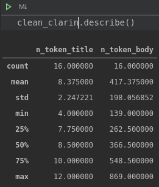</td>
    <td>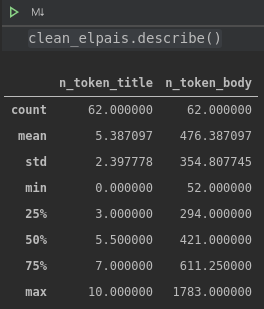</td>
    <td>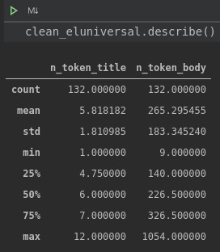</td>
    </tr>
  </table>
</div>

3. Con la función `%matplotlib inline` podremos ver los gráficos sin importar el módulo matplotlib

4. Graficamos y sacamos conclusiones.

- Con la linea `nombre_dataset['nombre_columna_para_analisis'].plot(style='k.')` podemos analizar la columna `nombre_columna_para_analisis` del data set `nombre_dataset` y sacar nuestras conclusiones. 
<div align="center"> 
  <table>
    <tr>
    <td>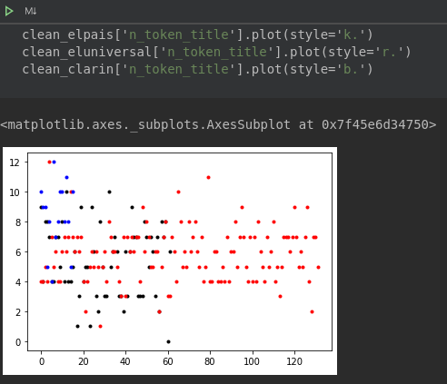</td>
    </tr>
  </table>
</div>

De este gráfico podemos concluir que la cantidad de palabras significativas de los títulos para el periodico **el pais** y **el universal** son similares, en cambio, para **clarín** suelen usar mas palabras para un titulo. Estas van entre **7 y 10 tokens**, palabras sigficativas. Para **el pais** y **el universal** las palabras significativas del titulos van entre **4 y 7 tokens**.

<div align="center"> 
  <table>
    <tr>
    <td>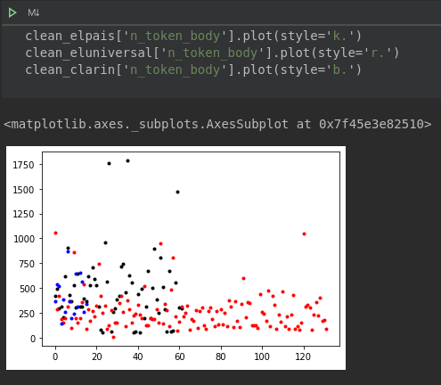</td>
    </tr>
  </table>
</div>

De este gráfico podemos concluir que la cantidad de palabras significativas del body para para el periodico **el pais** y **clarín** son similares, en cambio, para **el universal** suelen usar menos palabras para el artículo. Estas van entre **250 y 600 tokens**, palabras sigficativas. Para **el universal** las palabras significativas de los artículos van entre **50 y 250 tokens**.

Con esto podemos sacar una conclusión respecto a los periodicos. **El universal** tiene una politica editorial de generar artículos pequeños, seguramente para rápida lectura.  El **clarín** y **el pais** tienen una política contraria, donde se enfocan en artículos de mayor extensión. Tal vez con mayor contenido informativo. 

Código para plotear histogramas.
```py
# Lo que hacemos juntar todos los datasets en uno
all_newspapers = pd.concat([clean_eluniversal, clean_elpais, clean_clarin])

# Los agrupamos por el newspaper_uid
grouped = all_newspapers.groupby('newspaper_uid')

# Graficamos histogramas.
grouped.hist()
```

<div align="center"> 
  <table>
    <tr>
    <td>
    <p align="center">Histograma de Clarín</p></td>
  </table>
</div>

<div align="center"> 
  <table>
    <tr>
    <td>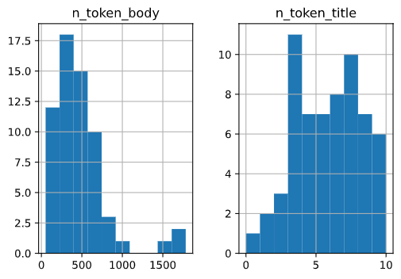
    <p align="center">Histograma de El País</p></td>
  </table>
</div>

<div align="center"> 
  <table>
    <tr>
    <td>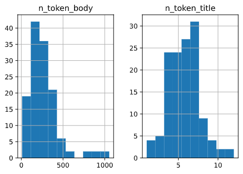
    <p align="center">Histograma de El Universal</p></td>
    </tr>
  </table>
</div>

<div align="center"> 
  <table>
    <tr>
    <td>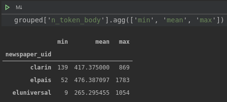</td>
    </tr>
  </table>
</div>


## Intro a Sistemas de Datos

### Introducción a los sistemas de datos

Los sistemas de datos vienen en muchos sabores y colores, SQL, NoSQL, especializados en procesamiento en bloque, chorro y streaming. Este tipo de sistema nos permite realizar queries sofisticadas y compartir nuestro trabajo con otros miembros del equipo.

- **Procesamiento de bloque**: Estamos hablando de datos históricos, qué sucedió ayer, en el trimestre pasado, cuáles fueron las ventas del año anterior o de los últimos cinco años. Nos permite realizar el procesamiento de manera eficiente.

- **Procesamiento en chorro**: Significa que estamos procesando los datos conforme van llegando, las transformaciones se realizan en tiempo real. Este tipo de sistema nos sirven para cuando queremos realizar decisiones en donde la importancia del tiempo es fundamental.

El criterio principal a tener en cuenta: El tiempo que tienes. Si bien los sistemas open source son gratis, para poderlos implementar necesitas tener conocimientos de cloud, debes poder saber trabajar y mantener máquinas.

#### SQL vs NoSQL

La discusión más relevante en el mundo de las aplicaciones web y móvil, donde dependiendo de la aplicación, la decisión puede ser fundamental para el crecimiento de la app.

La verdad es que para los profesionales en informática, especialmente los profesionales de los datos. Es necesario saber ambos.

- [**SQL**](https://es.wikipedia.org/wiki/SQL) (por sus siglas en inglés **Structured Query Language**; en español lenguaje de consulta estructurada) es un lenguaje de dominio específico utilizado en programación, diseñado para administrar, y recuperar información de sistemas de gestión de bases de datos relacionales. ºUna de sus principales características es el manejo del álgebra y el cálculo relacional para efectuar consultas con el fin de recuperar, de forma sencilla, información de bases de datos, así como realizar cambios en ellas. 

- [**NoSQL**](https://es.wikipedia.org/wiki/NoSQL) (a veces llamado **"no solo SQL"**) es una amplia clase de sistemas de gestión de bases de datos que difieren del modelo clásico de SGBDR (Sistema de Gestión de Bases de Datos Relacionales) en aspectos importantes, siendo el más destacado que no usan SQL como lenguaje principal de consultas. Los datos almacenados no requieren estructuras fijas como tablas, normalmente no soportan operaciones JOIN, ni garantizan completamente ACID (atomicidad, consistencia, aislamiento y durabilidad) y habitualmente escalan bien horizontalmente. _Los sistemas NoSQL se denominan a veces "no solo SQL" para subrayar el hecho de que también pueden soportar lenguajes de consulta de tipo SQL._

<div align="center"> 
  <table>
    <tr>
    <td>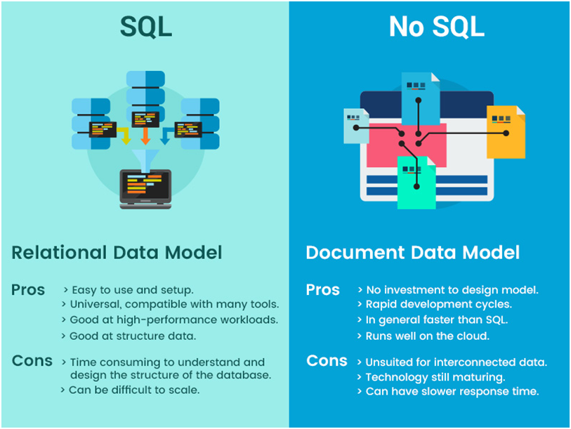</td>
    </tr>
  </table>
</div>

### Cargando datos a SQLite

En esta sección se hará el procedimiento de carga de datos o load data. Para realizar tal proceso se creo 3 archivos.
- **base.py**: Contiene los objetos que hacen a la base de datos.
  - Contendrá la varible que creará el motor de base de datos.
  - Enlace a una sesión individual al motor.
  - Una clase base, a esta se le asignará una metaclase que produce los objetos apropiados de `~ sqlalchemy.schema.Table` y realiza las llamadas apropiadas de `~ sqlalchemy.orm.mapper` en función de la información proporcionada de forma declarativa en la clase y en cualquier subclase de esta. Esto gracias al constructor `declarative_base()` para definir clases declarativas.

- **article.py**: Clase para estructurar los datos en una base de datos. Hereda de la **clase Base**
- **main.py**: Función que interactua con las otras clases y la terminal.
  - Tiene un funcón principal que nos permite crear el schema, tomar datos del csv y pasarlo a un .db

## ETL Pipeline - Automatización

En esta sección se realizó la automatización de todo el proceso ETL, utilizando los archivos generados. El proceso es el siguiente:
- **Extract (Extracción)**: Lo que hicimos fue un web scrapper como extracción de datos. 
- **Transform (Transformación)**. Transformamos los datos obtenidos en el web scrapper gracias a Pandas. 
- **Load (Carga)**: Finalizando con la carga de datos a una base de datos local. Se utilizará SQLite como tal. 

<div align="center"> 
  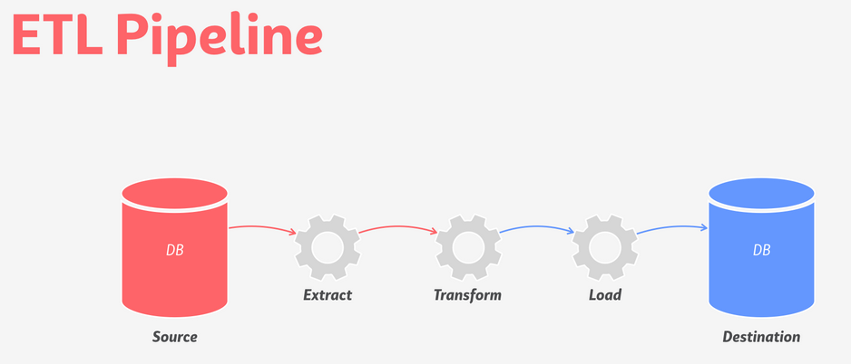
</div>

Los archivos creados en el proyecto son para manejarlos por consola. Lo que se hizo fue automatizar el proceso de abrir cada archivo por separado en un archivo **pipeline.py**. 
- Se utilizó la librería `subprocess`, esta nos permite manipular directamente archivos de terminal.
- Se crarán 5 funciones:
  - **main()**: Función principal ETL.  
  - **_extract()**: Función para automatizar extracción de datos.
  - **_transform()**: Función para automatizar la tranformación de datos.
  - **_load()**: Función para automatizar la carga de datos.
  - **_to_databe_folder()**: Función para mover base de datos database folder.

## Contenido Bonus
### Porque usar la nube

La nube nos da un poder de cómputo casi inimaginable, nos permite procesar terabytes de datos en segundos. La nube se puede usar en dos grandes ocasiones: 
- Cuando los datos ya no caben en tu computadora local.
- Cuando el tiempo de procesamiento esta siendo muy extenso

Es en ese momento donde deberías usar la nube.

Si estas en un entorno de producción, si estas trabajando en una empresa y los datos de esa empresa ya viven en la nube, lo lógico es realizar el trabajo en la nube. Automatizar los scripts en ese mismo ambiente.

Diversas nubes ya ofrecen paquetes completos para el ciclo de datos, como [**Google Cloud**](https://cloud.google.com/):

- Dataflow
- Pub/Sub
- Cloud Storage
- Datalab
- BigQuery
- Dataproc
- Firestore


